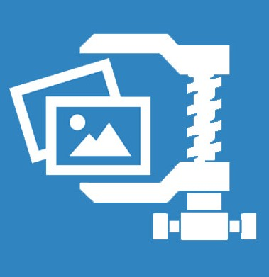

### Notice
This project has reached its tail. TheDoggyBrad Image Compressor has now been replaced by [Downscayl](https://downscayl.github.io) on June 23, 2024. Downscayl can be accessed on [https://downscayl.github.io](https://downscayl.github.io). This project has been the foundation of the new Downscayl project.   With that, this project's website will offer you whether to go to the new Downscayl project or visit this retired project. 
After everything has been set to sunset, this repository shall turn to an archive. 
Thank you!
  

# TheDoggyBrad Image Compressor
A client side image compressor performed via JavaScript.

## Try it now!
Try it out on https://thedoggybrad.github.io/imagecompressor 
Also available as a Progressive Web Application (PWA).

## Usages
You can use this compressor when:
 
✓An online form declines your image due to file sizing issues 
✓Your image file size is too big for file sharing or for website use 
✓To help reduce bandwidth usage due to a big image file size

## Features and Characteristics
✓No Data Collection 
✓100% Privacy-Friendly 
✓Quality Slider selection 
✓View Image before download 
✓Easy Download button 
✓Works offline 
✓Everything is done on your side 
✓No server interactions for compression 
✓Device Hardware Dependent 
✓Internet Connection Independent 
✓Faster (than server-side solutions) 
✓No eye burning sensations (a.k.a Force Dark Mode) 
✓Compact Interface 
✓Easy to learn, understand, use and operate

## Limitations
The "limitations" is not on the software itself. The "limitations" are defined by your web browser's capabilities and by your hardware capabilies.

## Software Licensing
This software uses the [UPDER-FOSDL License](https://github.com/thedoggybrad/imagecompressor/blob/main/LICENSE). It means that you may do whatever you want on this software, even without TheDoggyBrad's approval/permission and that is considered "legal".
